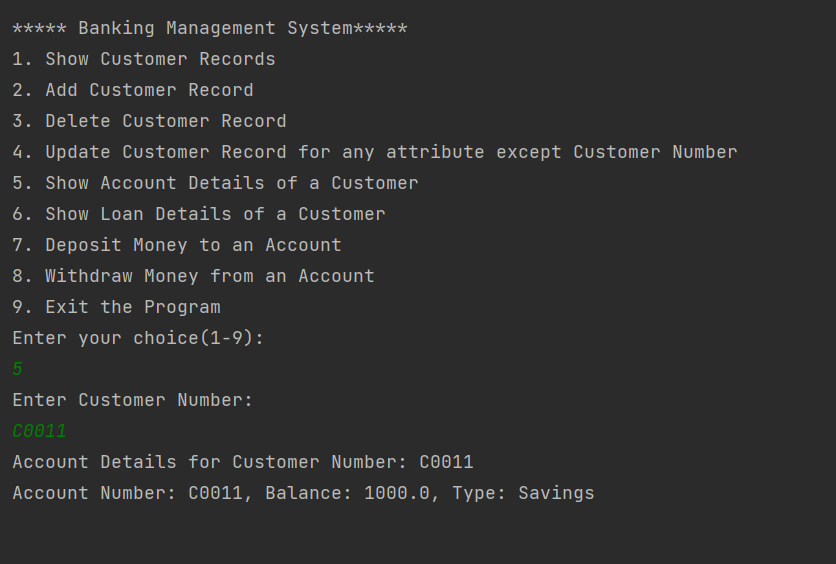
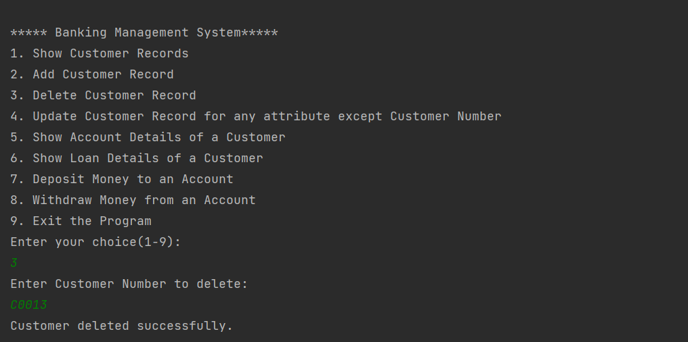
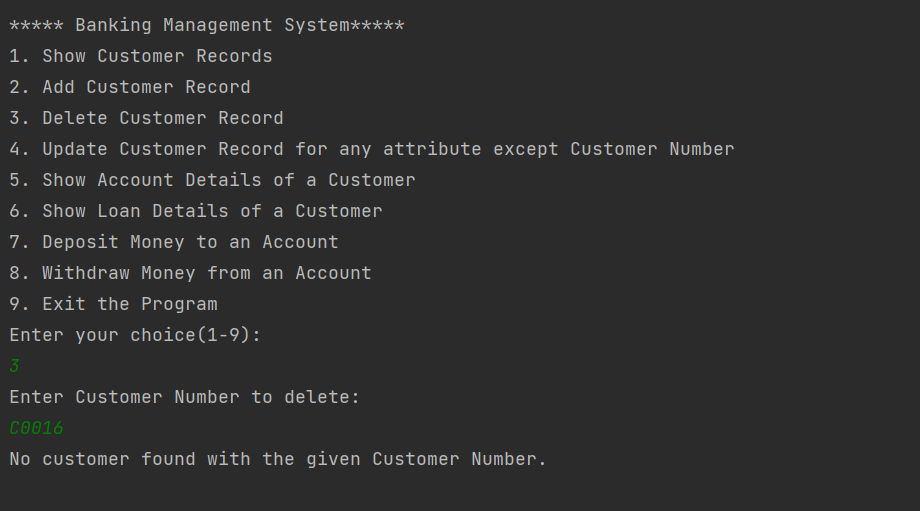
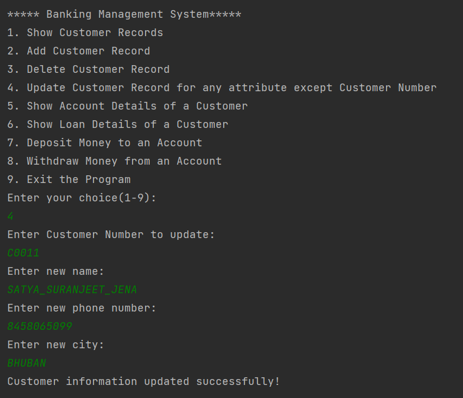
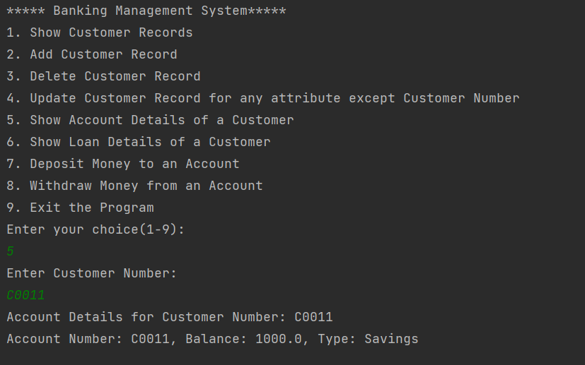
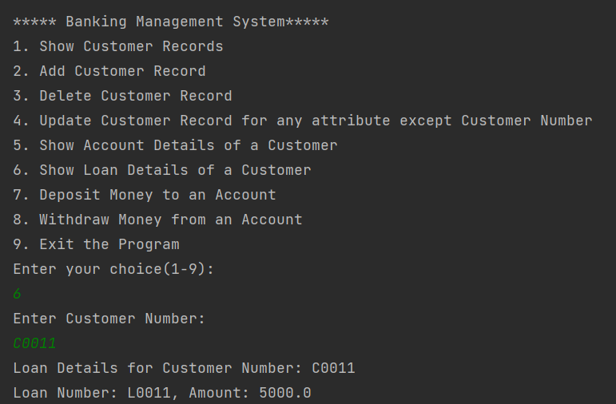
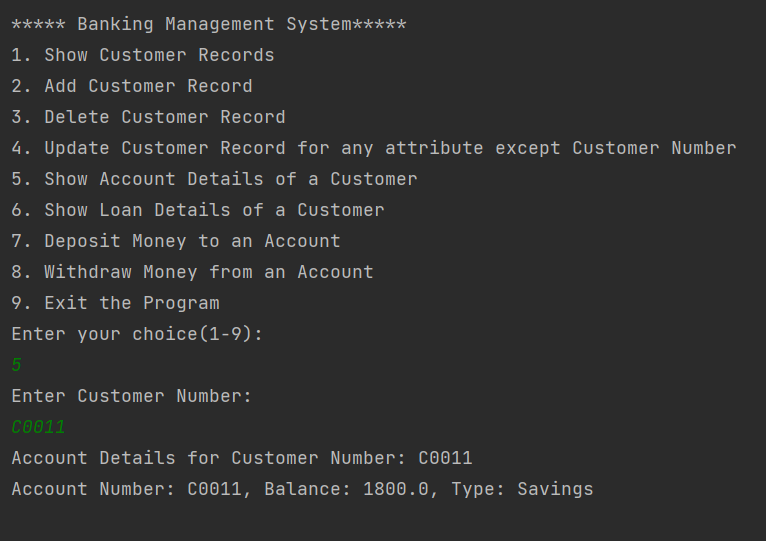
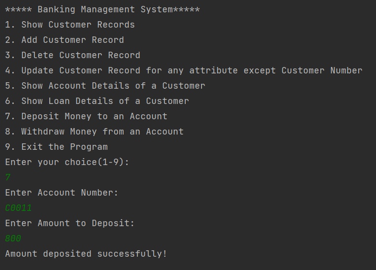

# Java-OracleSQL Database Interaction

This Java project demonstrates basic CRUD operations with an Oracle SQL database using JDBC.

## Requirements

- Java Development Kit (JDK)
- Oracle SQL database (local or server)
- Oracle JDBC driver (included in the project)

## Project Setup

1. **Clone the repository**:
   ```bash
   git clone https://github.com/your/repository.git
   cd Java-OracleSQL-Database
   ```

2. **Set up the Oracle JDBC driver**:
   - Download the Oracle JDBC driver (ojdbc.jar).
   - Add it to your project's classpath or dependency management system (e.g., Maven).

3. **Configure database connection**:
   - Modify `DatabaseConnector.java` to provide your Oracle database credentials (`url`, `username`, `password`).

4. **Compile and run the application**:
   ```bash
   javac Main.java
   java Main
   ```

## Features

- **Menu-driven interface**: Allows users to choose operations (insert, update, delete, select).
- **Exception handling**: Handles database connectivity issues and SQL exceptions gracefully.
- **Basic CRUD operations**: Demonstrates creating, reading, updating, and deleting records in the database.

## Usage

- Upon running the application, follow the prompts to perform database operations.
- Select an option from the menu:
  - `1`: Insert a new record
  - `2`: Update an existing record
  - `3`: Delete a record
  - `4`: Retrieve all records
  - `0`: Exit the program

## Example

Assume you have a `Users` table in your Oracle database with columns `id`, `name`, and `email`.

1. Insert operation:
   - Enter `1` and provide `name` and `email` for a new user.
   
2. Update operation:
   - Enter `2`, specify the `id` of the user to update, and provide new `name` and `email`.
   
3. Delete operation:
   - Enter `3` and specify the `id` of the user to delete.
   
4. Select operation:
   - Enter `4` to retrieve and display all users from the database.

## Screenshots











## Contributors

- [Your Name](https://github.com/kumarvijay07)

## License

This project is licensed under the MIT License - see the [LICENSE.md](LICENSE.md) file for details.

